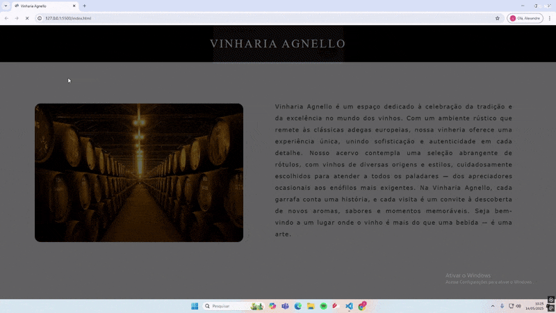

# vinheria-agnello-checkpoint02
Nosso sistema foi criado para tornar o controle de estoque mais eficiente e inteligente. Ele registra automaticamente todas as entradas e saídas de produtos, garantindo que o estoque esteja sempre atualizado. Com isso, é possível evitar problemas como a falta de vinhos procurados ou o acúmulo de itens com pouca saída.
Além disso, o sistema identifica automaticamente o vinho com a safra mais antiga e também classifica cada vinho de acordo com sua idade, utilizando categorias como jovem , amadurecido e antigo, oferecendo ao gestor uma visão mais estratégica sobre o perfil do estoque.
Dessa forma, a gestão do estoque se torna mais organizada, econômica e totalmente alinhada com as necessidades reais do negócio.

### Integrantes

- **Alexandre Martins Lucas** — RM: 561732  
- **Murilo Macedo Pina** — RM: 563397  
- **Diego Bondezan Yonamine** — RM: 562013  
- **Vitor Carvalho Alexandre** — RM: 562298  
- **Felipe Otávio Garcia Madeira** — RM: 563521  

### Para acessar o projeto

[GitHub Pages](https://muriloonn.github.io/vinheria-agnello-checkpoint02/)

### Demonstração do projeto

